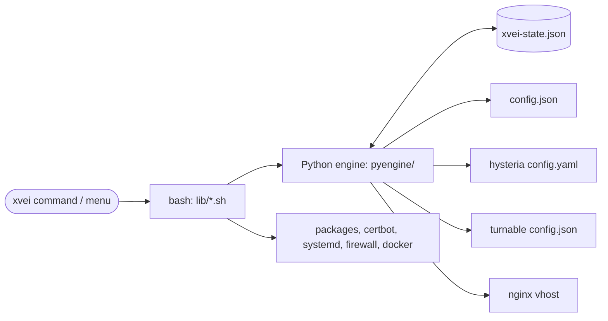
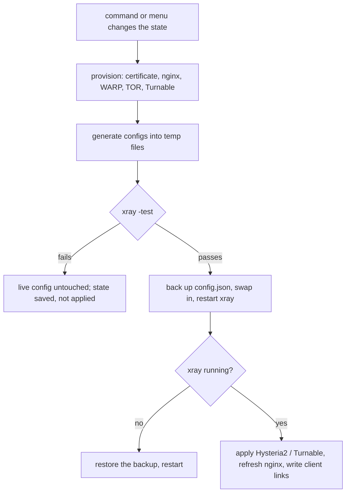

# How it works

[🇷🇺 Русская версия](../ru/architecture.md) · [← Home](index.md)

## Components

- **State file** `/usr/local/etc/xray/xvei-state.json` is the single source of
  truth: inbounds with their keys and passwords, outbounds, rules, template,
  site, domain and certificate paths.
- **Python engine** (standard library only) changes the state and generates
  every config from it. It never touches the system.
- **Bash part** does everything system-side: packages, certificates, nginx,
  services, firewall, WARP container, Turnable.

## Applying a change

If `config.json` was edited by hand since xvei last wrote it, xvei asks before
overwriting it.

## One port 443 for many inbounds

`vless-tls` owns TCP port 443 and terminates TLS. Whatever is not VLESS is
handed on by *fallbacks*, chosen by request path and ALPN:

The secret paths are random; a normal browser always ends up on the camouflage
site. The internal hops use local sockets and never leave the server.

## Inbounds that are not Xray

Hysteria2 and Turnable are separate programs. They receive the traffic and pass
it into a local inbound of Xray, so Xray does all the routing for them too:

## Routing order

Rules are checked top to bottom; the first match wins.

1. **Guardrails** — BitTorrent, private addresses and Windows file-sharing
   ports are blocked.
2. **Your rules** — `block`, `direct`, `warp`, `tor`, then one list per added
   outbound.
3. **Template** — in-country traffic goes to the chosen exit (WARP, TOR, an
   added outbound, or block — never direct); for `popular`, the popular
   services go direct.
4. **Everything else** — direct, or through the chosen tunnel.

## Taking over an existing setup

When an existing Xray is adopted, its config becomes the base and xvei only adds
to it:

- existing inbounds and outbounds stay first, so the existing default outbound
  stays the default;
- xvei's rules and template go before the existing rules;
- no guardrails and no "everything else" rule are added unless an exit mode is
  chosen explicitly;
- tor, the WARP container, Hysteria2, Turnable and nginx are only stopped or
  changed if xvei started them itself (markers in `/var/lib/xvei/managed`).
