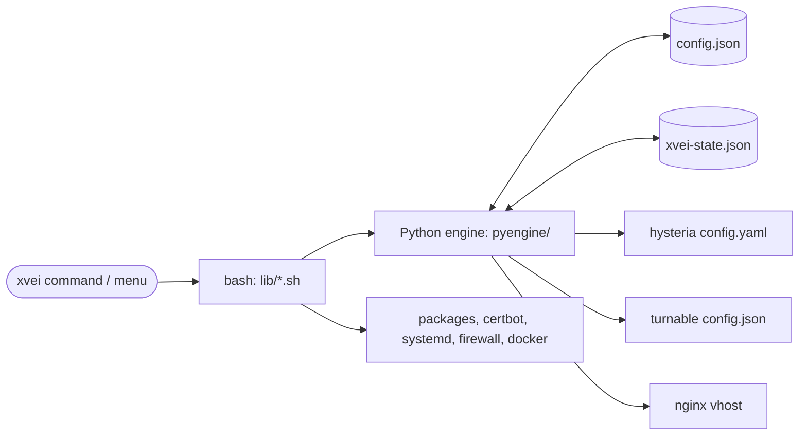
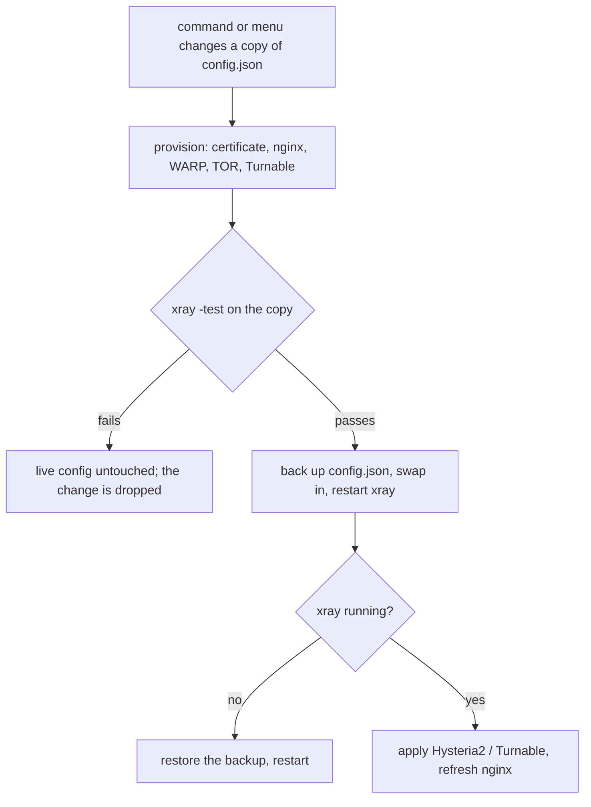
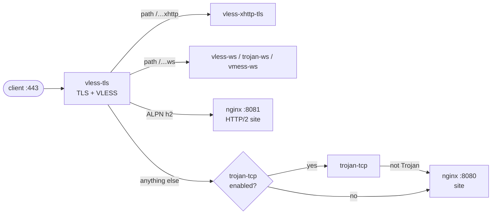
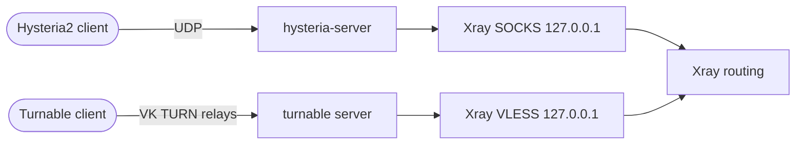

# How it works

[🇷🇺 Русская версия](../ru/architecture.md) · [← Home](index.md)

## Components

- **`config.json`** is the source of truth for everything Xray runs:
  inbounds, outbounds and routing rules. Every command reads it fresh, so what
  was edited by hand is shown in the menus, linked and used at once.
- **State file** `/usr/local/etc/xray/xvei-state.json` keeps only what
  `config.json` cannot hold: domain, e-mail, certificate paths, the camouflage
  site, which inbounds and services xvei created itself (so it never stops
  someone else's nginx or WARP), and the Hysteria2 / Turnable settings.
- **Python engine** (standard library only) makes a change on a copy of
  `config.json` and stages it; it renders the Hysteria2 / Turnable / nginx
  configs. It never touches the system.
- **Bash part** does everything system-side: packages, certificates, nginx,
  services, firewall, WARP container, Turnable.

## Applying a change

Every change starts from `config.json` as it is on disk, so edits made by hand
are kept - xvei never rebuilds the file from its own copy.

## One port 443 for many inbounds

`vless-tls` owns TCP port 443 and terminates TLS. Whatever is not VLESS is
handed on by *fallbacks*, chosen by request path and ALPN:

The secret paths are random; a normal browser always ends up on the camouflage
site. The internal hops use local sockets and never leave the server.

## Inbounds that are not Xray

Hysteria2 and Turnable are separate programs. They receive the traffic and pass
it into a local inbound of Xray, so Xray does all the routing for them too:

## Routing order

Rules are checked top to bottom; the first match wins; traffic that matches
nothing takes the first outbound. A fresh config starts like this:

1. **Guardrails** — BitTorrent, private addresses and Windows file-sharing
   ports are blocked.
2. **Your rules** — `xvei rule add <outbound> <matcher>` adds to a rule that
   already sends such matchers there, or creates one at the top (after the
   guardrails).
3. **Template** — in-country traffic goes to the chosen exit (WARP, TOR, an
   outbound, or block — never direct); for `popular`, the popular services go
   direct. A template's rules are recognised by what they match; one edited by
   hand becomes an ordinary rule.
4. **Everything else** — the last rule, when it only matches `network
   tcp,udp`: direct, or through the chosen tunnel.

All of it is plain rules in `config.json`; `xvei rule list` shows them
numbered, `xvei rule delete <N>` removes any of them.

## Taking over an existing setup

Adopting an existing Xray changes nothing, and from then on its `config.json`
is handled like any other: its inbounds, outbounds and rules are listed,
linked, used and removable; its first outbound stays the default route; no
guardrails and no "everything else" rule are added unless chosen. tor, the WARP
container, Hysteria2, Turnable and nginx are only stopped or changed if xvei
started them itself (markers in `/var/lib/xvei/managed`).
