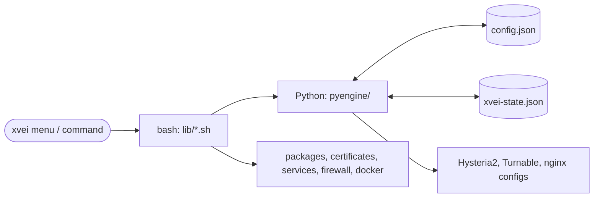
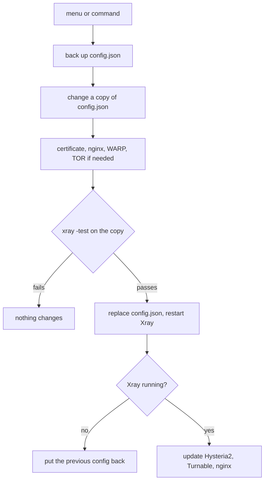
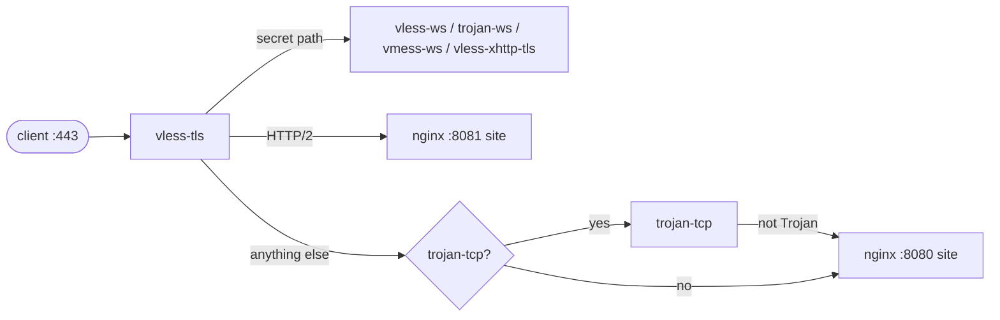
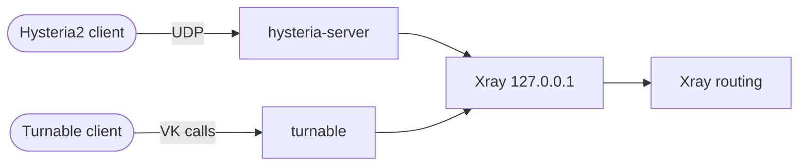

# How it works

## Parts

- **`config.json`** (`/usr/local/etc/xray/`) is the Xray config and the main
  source of truth. xvei reads it on every run, so edits made by hand are seen
  at once.
- **`xvei-state.json`** next to it keeps only what `config.json` cannot hold:
  domain, certificate, camouflage site, Hysteria2 / Turnable settings, and
  what xvei created itself (so it never touches someone else's nginx or WARP).
- **Python part** (standard library only) changes the config.
- **Bash part** does the system work: packages, certificates, nginx, services,
  firewall.

## How a change is applied

The change always starts from `config.json` as it is on disk, so hand edits are
kept.

## One port 443 for many inbounds

`vless-tls` holds port 443 and handles encryption. What is not VLESS it passes
on by request path and protocol:

The paths are random, so a browser always lands on the camouflage site. The
inner hops stay inside the server.

## Hysteria2 and Turnable

They are separate programs that pass traffic into a local Xray inbound, so
Xray's routing rules apply to them too:

The order of routing rules is described in [routing](routing.md#order-of-the-rules).
