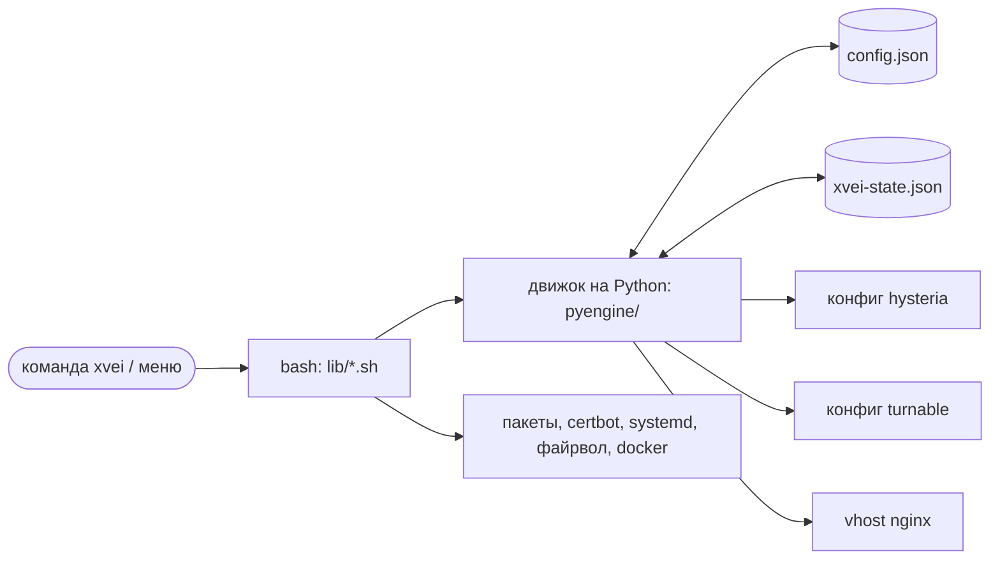
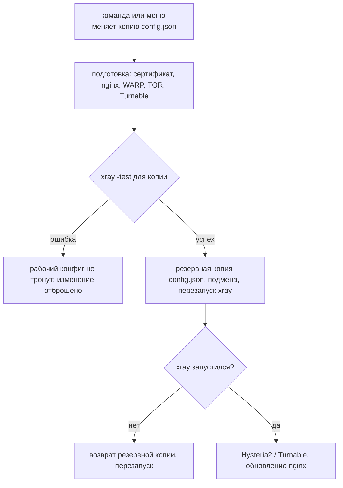
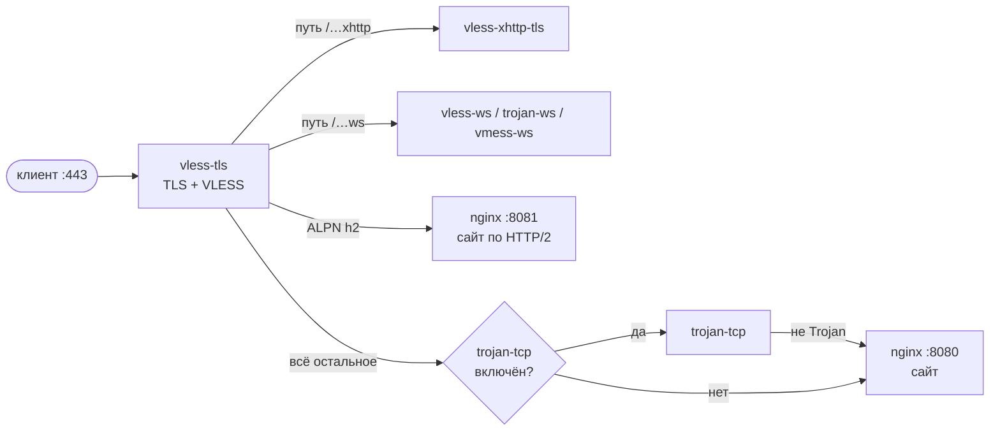

# Как это работает

[🇬🇧 English version](../en/architecture.md) · [← Главная](index.md)

## Компоненты

- **`config.json`** — источник правды для всего, что запускает Xray:
  inbounds, outbounds и правил маршрутизации. Каждая команда читает его
  заново, поэтому всё, что правили вручную, сразу видно в меню, получает
  ссылки и используется.
- **Файл состояния** `/usr/local/etc/xray/xvei-state.json` хранит только то,
  чего нет в `config.json`: домен, e-mail, пути к сертификату, сайт-прикрытие,
  какие inbounds и сервисы создал сам xvei (чтобы не останавливать чужой nginx
  или WARP), и настройки Hysteria2 / Turnable.
- **Движок на Python** (только стандартная библиотека) вносит изменение в
  копию `config.json` и откладывает её на применение; собирает конфиги
  Hysteria2 / Turnable / nginx. Систему он не трогает.
- **Часть на bash** делает всё системное: пакеты, сертификаты, nginx, сервисы,
  файрвол, контейнер WARP, Turnable.

## Применение изменения

Любое изменение начинается с `config.json` в том виде, в каком он лежит на
диске, поэтому ручные правки сохраняются — xvei никогда не пересобирает файл из
своей копии.

## Один порт 443 на много inbounds

`vless-tls` занимает TCP-порт 443 и расшифровывает TLS. Всё, что не VLESS,
передаётся дальше через *фолбэки* — по пути запроса и ALPN:

Секретные пути случайные; обычный браузер всегда попадает на сайт-прикрытие.
Внутренние переходы идут через локальные сокеты и не покидают сервер.

## Inbounds, которые не Xray

Hysteria2 и Turnable — отдельные программы. Они принимают трафик и передают его
в локальный inbound Xray, поэтому и для них маршрутизацию делает Xray:

## Порядок правил

Правила проверяются сверху вниз, срабатывает первое подходящее; трафик, под
который не подошло ни одно, уходит в первый outbound. Новый конфиг начинается
так:

1. **Защитные правила** — блокируются BitTorrent, приватные адреса и порты
   общего доступа к файлам Windows.
2. **Ваши правила** — `xvei rule add <outbound> <матчер>` дописывает в
   правило, которое уже отправляет такие матчеры туда, или создаёт новое
   наверху (после защитных).
3. **Шаблон** — внутристрановой трафик уходит в выбранный выход (WARP, TOR,
   outbound или блокировка — никогда напрямую); для `popular` популярные
   сервисы идут напрямую. Правила шаблона узнаются по содержимому; правило,
   изменённое вручную, становится обычным.
4. **Всё остальное** — последнее правило, если оно совпадает только по
   `network tcp,udp`: напрямую или через выбранный туннель.

Всё это — обычные правила в `config.json`; `xvei rule list` показывает их с
номерами, `xvei rule delete <N>` удаляет любое.

## Приём существующей настройки

Приём существующего Xray ничего не меняет, а дальше его `config.json`
обрабатывается как любой другой: его inbounds, outbounds и правила видны,
получают ссылки, используются и удаляются; первый outbound остаётся маршрутом
по умолчанию; защитные правила и правило «всё остальное» не добавляются, пока
их не выбрали. tor, контейнер WARP, Hysteria2, Turnable и nginx
останавливаются или меняются, только если их запустил сам xvei (метки в
`/var/lib/xvei/managed`).
