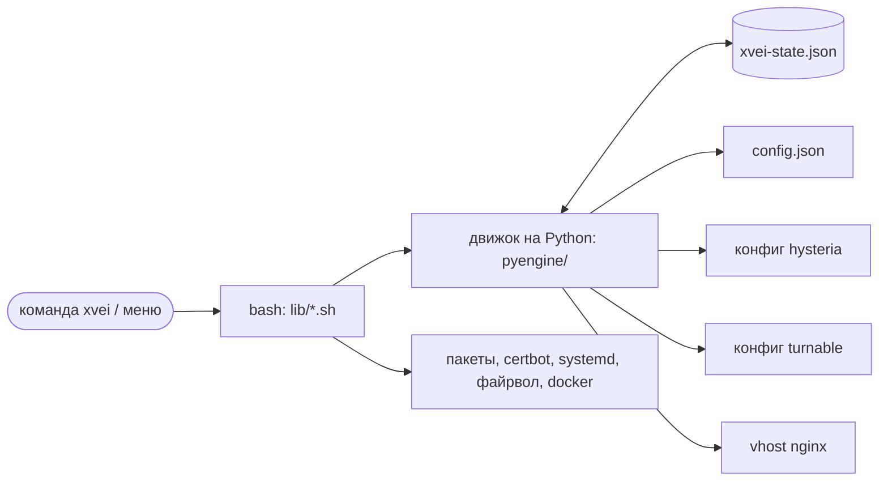
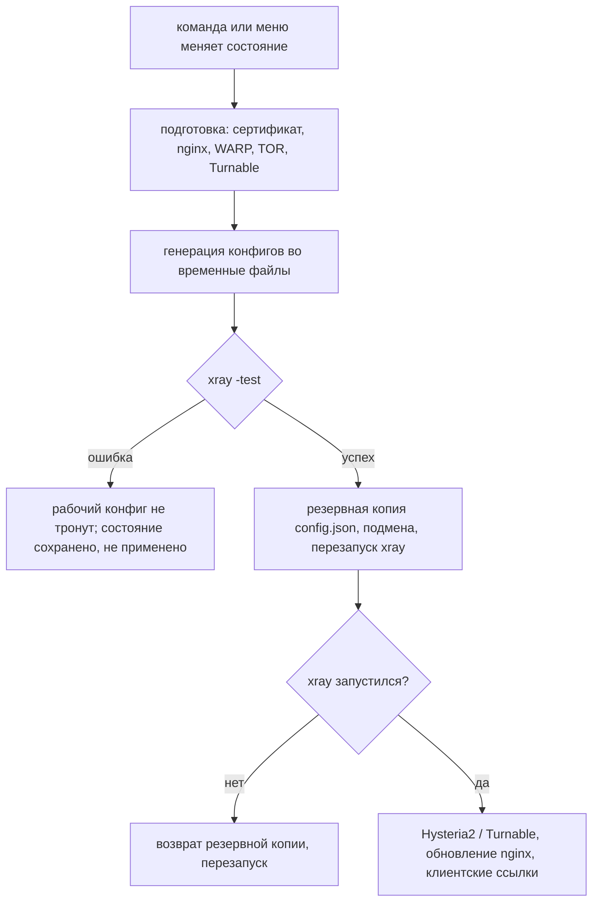
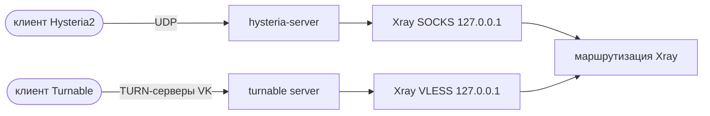

# Как это работает

[🇬🇧 English version](../en/architecture.md) · [← Главная](index.md)

## Компоненты

- **Файл состояния** `/usr/local/etc/xray/xvei-state.json` — единственный
  источник правды: inbounds с ключами и паролями, outbounds, правила, шаблон,
  сайт, домен и пути к сертификатам.
- **Движок на Python** (только стандартная библиотека) меняет состояние и
  генерирует из него все конфиги. Систему он не трогает.
- **Часть на bash** делает всё системное: пакеты, сертификаты, nginx, сервисы,
  файрвол, контейнер WARP, Turnable.

## Применение изменения

Если `config.json` правили вручную после последней записи xvei, xvei спросит
перед перезаписью.

## Один порт 443 на много inbounds

`vless-tls` занимает TCP-порт 443 и расшифровывает TLS. Всё, что не VLESS,
передаётся дальше через *фолбэки* — по пути запроса и ALPN:

Секретные пути случайные; обычный браузер всегда попадает на сайт-прикрытие.
Внутренние переходы идут через локальные сокеты и не покидают сервер.

## Inbounds, которые не Xray

Hysteria2 и Turnable — отдельные программы. Они принимают трафик и передают его
в локальный inbound Xray, поэтому и для них маршрутизацию делает Xray:

## Порядок правил

Правила проверяются сверху вниз; срабатывает первое совпавшее.

1. **Защитные правила** — блокируются BitTorrent, частные адреса и порты
   общего доступа к файлам Windows.
2. **Ваши правила** — `block`, `direct`, `warp`, `tor`, затем по списку на
   каждый добавленный outbound.
3. **Шаблон** — внутристрановой трафик уходит в выбранный выход (WARP, TOR,
   добавленный outbound или блокировка — никогда напрямую); для `popular`
   популярные сервисы идут напрямую.
4. **Всё остальное** — напрямую или через выбранный туннель.

## Приём существующей настройки

Когда принимается существующий Xray, его конфиг становится основой, а xvei
только добавляет к нему:

- существующие inbounds и outbounds остаются первыми, поэтому outbound по
  умолчанию не меняется;
- правила и шаблон xvei ставятся перед существующими правилами;
- защитные правила и правило «всё остальное» не добавляются, пока режим выхода
  не выбран явно;
- tor, контейнер WARP, Hysteria2, Turnable и nginx останавливаются или
  меняются, только если их запустил сам xvei (метки в `/var/lib/xvei/managed`).
