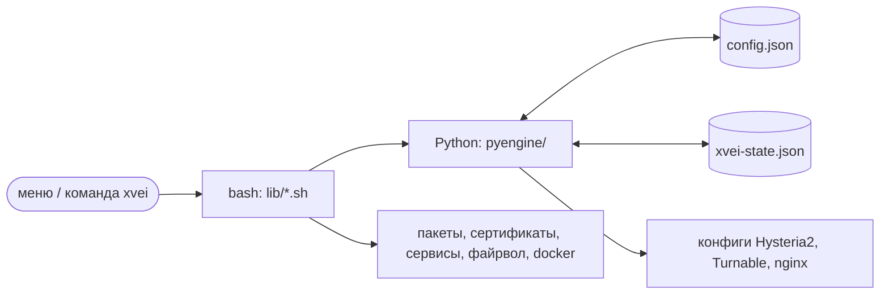
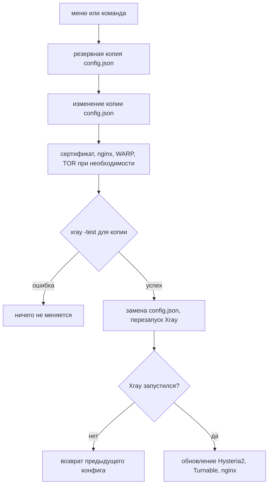
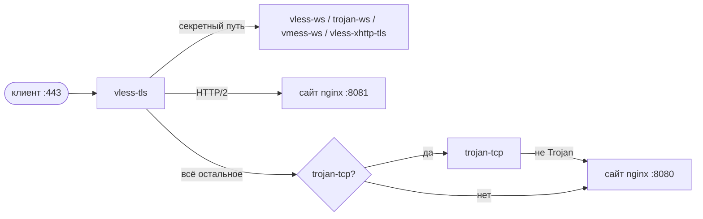
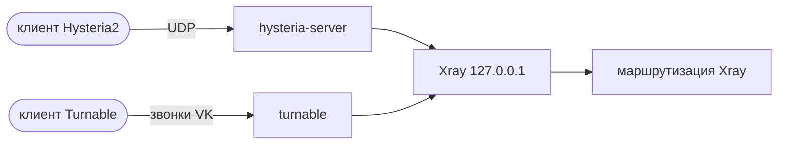

# Как это работает

## Части

- **`config.json`** (`/usr/local/etc/xray/`) — конфиг Xray и главный источник
  правды. xvei читает его при каждом запуске, поэтому ручные правки видны
  сразу.
- **`xvei-state.json`** рядом хранит только то, чего нет в `config.json`:
  домен, сертификат, сайт-прикрытие, настройки Hysteria2 / Turnable и то, что
  xvei создал сам (чтобы не трогать чужой nginx или WARP).
- **Часть на Python** (только стандартная библиотека) меняет конфиг.
- **Часть на bash** делает системную работу: пакеты, сертификаты, nginx,
  сервисы, файрвол.

## Как применяется изменение

Изменение всегда начинается с `config.json` в том виде, в каком он лежит на
диске, поэтому ручные правки сохраняются.

## Один порт 443 на много inbounds

`vless-tls` занимает порт 443 и отвечает за шифрование. То, что не VLESS, он
передаёт дальше по пути запроса и протоколу:

Пути случайные, поэтому браузер всегда попадает на сайт-прикрытие. Внутренние
переходы не выходят за пределы сервера.

## Hysteria2 и Turnable

Это отдельные программы, которые передают трафик в локальный inbound Xray,
поэтому правила маршрутизации Xray действуют и на них:

Порядок правил маршрутизации описан в [маршрутизации](routing.md#порядок-правил).
