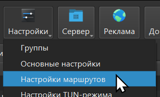
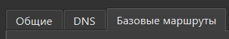
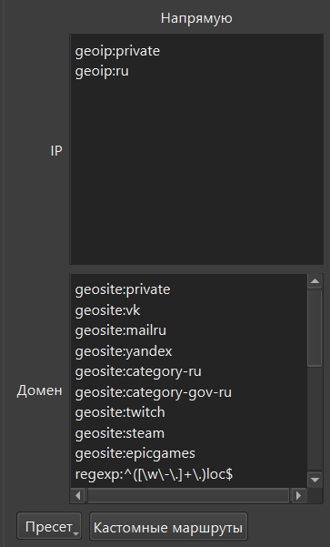
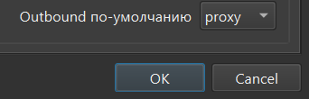

# Клиенты

[🇬🇧 English version](../en/clients.md) · [← Главная](index.md)

[v2rayNG](https://github.com/2dust/v2rayNG/releases/latest),
[NekoBox / nekoray](https://github.com/MatsuriDayo/nekoray/releases/latest),
[Hiddify](https://hiddify.com/). Для REALITY и XHTTP нужен свежий клиент.

[Turnable](https://github.com/TheAirBlow/Turnable/releases/latest) — клиент для inbound `turnable` (Linux, Windows,
macOS, Android через Termux).

> [!CAUTION]
> Клиентское приложение видит весь ваш трафик. Используйте только приложения,
> которым доверяете, скачивайте их с официальных страниц и помните: любой
> исполняемый файл вы устанавливаете на свой страх и риск.

## Совет по маршрутизации на клиенте

Это про локальный сплит-туннелинг на **устройстве клиента** (свой ISP вместо
VPN) — с сервером он не связан и не палит его IP. Шаблон уже кладёт такие
правила «внутристрановое / популярное → напрямую» в `~/xray_eis/<tag>.json`.
Если приложение импортирует только ссылку `vless://`, добавьте на клиенте
правила direct вручную, например для России:

**IP:** `geoip:private`, `geoip:ru`
**Домены:** `geosite:private`, `geosite:category-ru`, `geosite:category-gov-ru`

### NekoBox по шагам

1. Откройте **Настройки → Настройки маршрутов**.

   

2. Перейдите на вкладку **Базовые маршруты**.

   

3. В колонку **Напрямую** впишите списки IP и доменов из примера выше (так же
   можно добавить и другие сервисы своей страны).

   

4. Оставьте **Outbound по-умолчанию** = `proxy` и нажмите **OK**.

   
